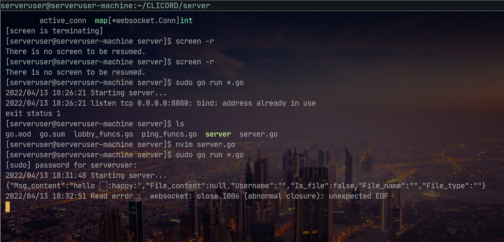
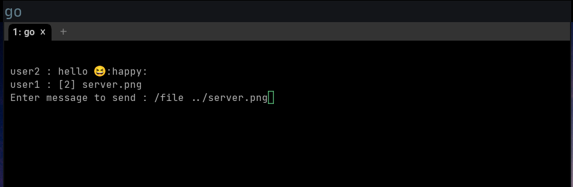
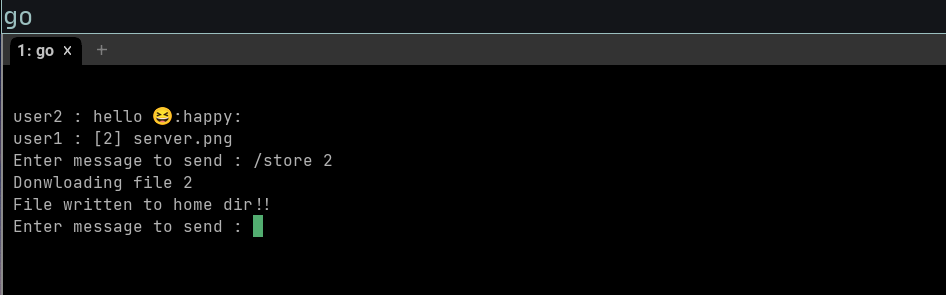

# CLICORD : Chat App in GOLANG 

## Team Members : 
- P K Navin Shrinivas [PES2UG20CS237]
- Mohamed Ayaan [PES2UG20CS200]
- Mukund Deepak [PES2UG20CS206]

## Abstract of project 

The aim was to build a entire CLI focused chat app using golang, but not just any simple chat app. We implemented the following feature on top of basic chat system : 
- Emojis support (Yes, emojis in terminal!)
- File transfer 
- Lobby based chat system 
- Stateless websockets system 

We surely wanted to do more on this project such as : 
- End to end encryption 
- TUI [We had quit nasty bugs on CLI ]
- Work out an authentication system for one on one chatting 
- Ofc a fast as hell backend for storing messages.

But given the time frame of just ~5hrs for this project, all the following could not be done.

## Output screenshots : 

**Server :** 

We have a global server hosting out server program, using Dynamic DNS and Little port forwarding we made our server accessible from catss.me:8080 [its just a laptop so its down most of the time :'( ], anyways, the screenshot : 

**Client :**

## The project : 

We have this project up on github and open for contributions at all times : [here](https://github.com/NavinShrinivas/CLICORD)

As for this submission, a modified version [only the port and server link] has been submitted in zip files such that it can be run on localhost.
